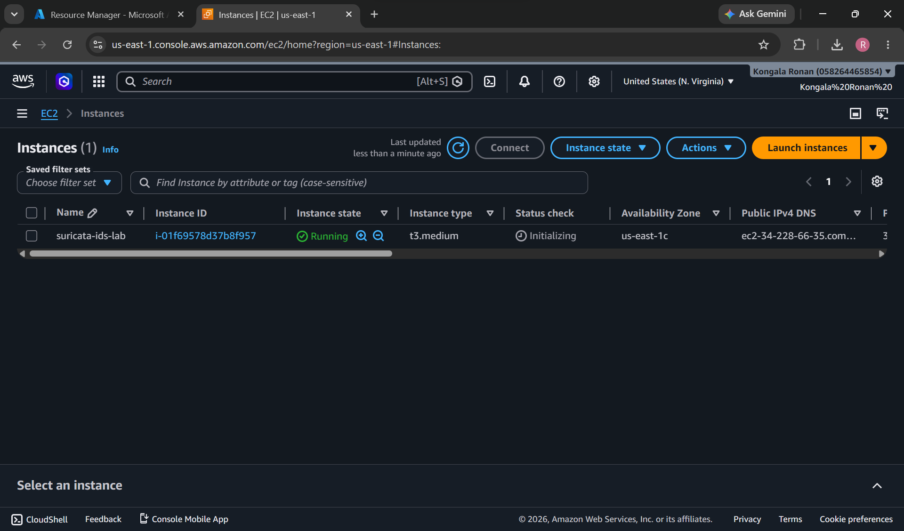
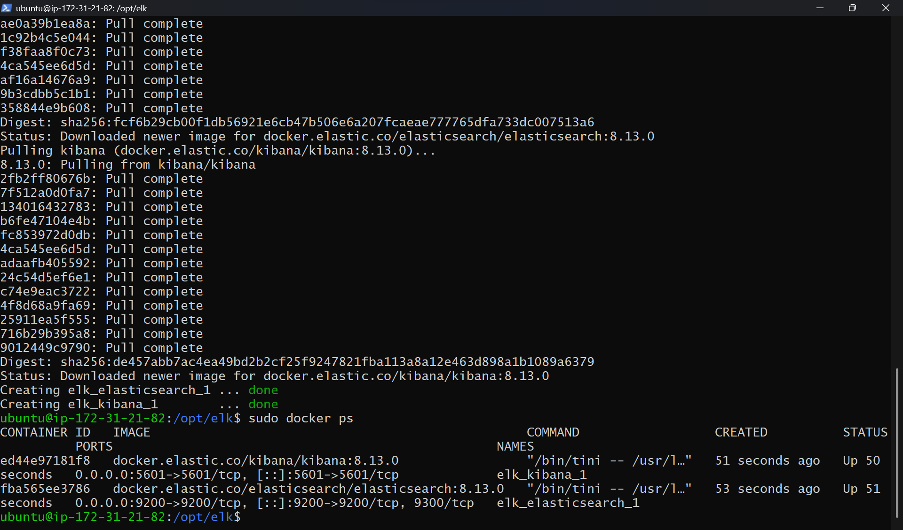
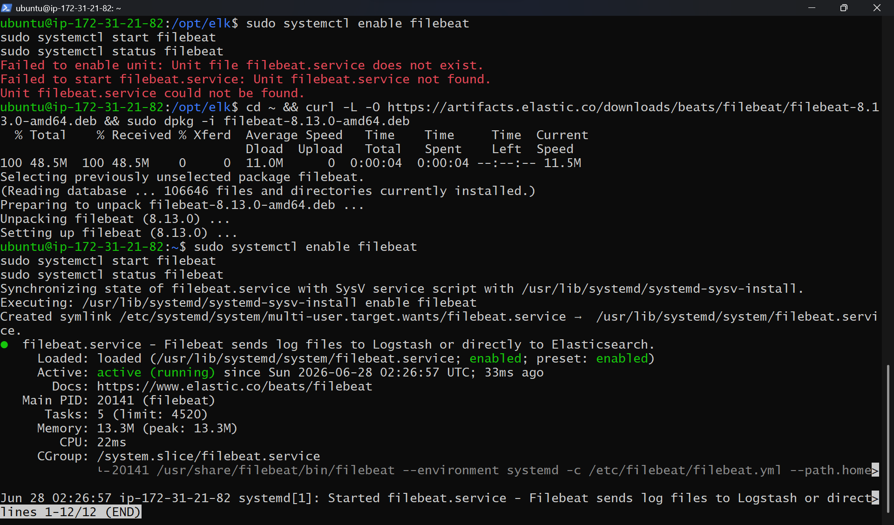
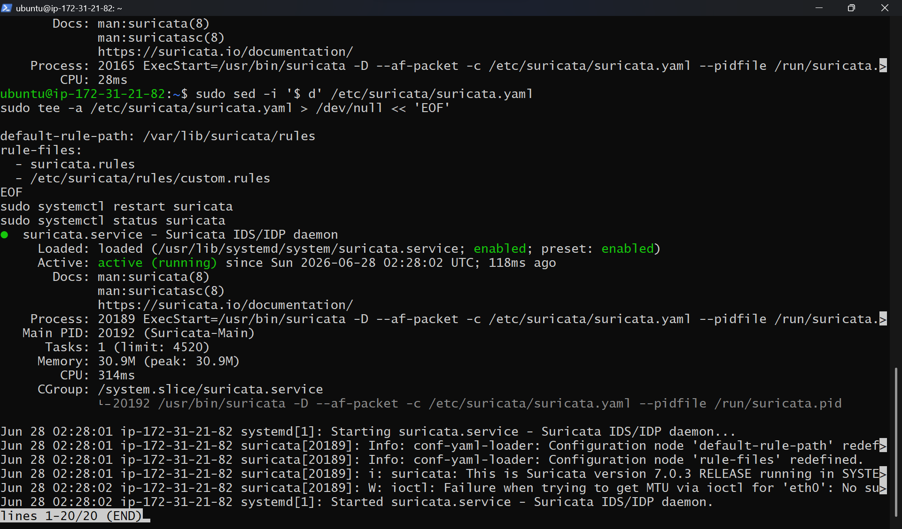
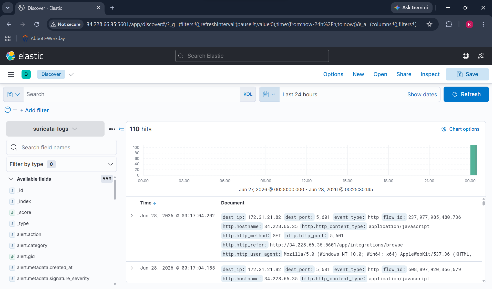
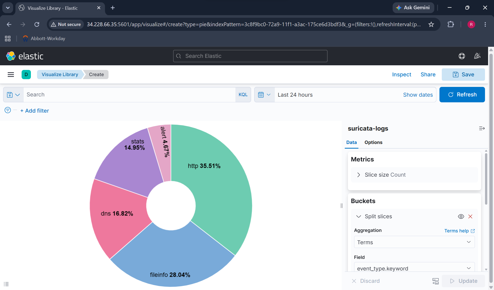
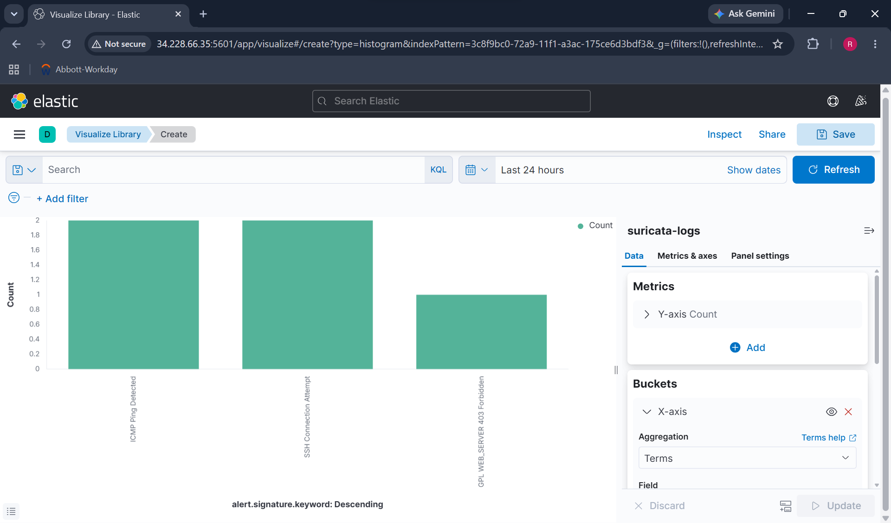
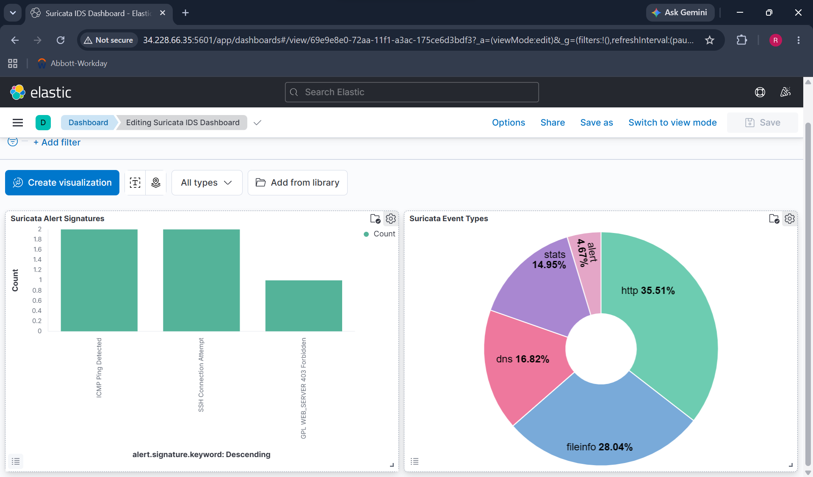
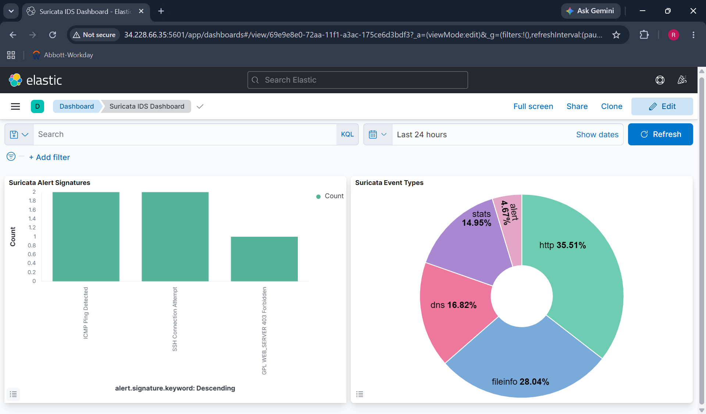

# Suricata IDS + ELK Stack on AWS EC2

A network intrusion detection lab deployed on AWS EC2 running Suricata 7.0.3 IDS with custom detection rules, integrated with an ELK stack (Elasticsearch + Kibana) via Docker for real-time log ingestion and threat visualization.

---

## Architecture

```
AWS EC2 (Ubuntu 24.04, t3.medium)
      |
      +-- Suricata 7.0.3 (IDS monitoring ens5 interface)
      |         |
      |         +-- /var/log/suricata/eve.json (JSON alert log)
      |
      +-- Filebeat (log shipper)
      |         |
      |         +-- Ships eve.json to Elasticsearch
      |
      +-- Docker
            |
            +-- Elasticsearch 7.17.0 (port 9200)
            |
            +-- Kibana 7.17.0 (port 5601)
                      |
                      +-- Suricata IDS Dashboard
```

---

## Services Used

| Service | Purpose |
|---|---|
| AWS EC2 (t3.medium) | Host for all IDS and SIEM components |
| Suricata 7.0.3 | Network IDS monitoring live traffic |
| Elasticsearch 7.17.0 | Log storage and search engine |
| Kibana 7.17.0 | Visualization and dashboards |
| Filebeat 8.13.0 | Log shipper from Suricata to Elasticsearch |
| Docker + Docker Compose | Container runtime for ELK stack |

---

## Custom Detection Rules

Three custom Suricata rules written for this lab:

| Rule | Signature | SID |
|---|---|---|
| ICMP Ping Detection | `alert icmp any any -> $HOME_NET any` | 1000001 |
| SSH Connection Attempt | `alert tcp any any -> $HOME_NET 22` | 1000002 |
| HTTP Traffic Detection | `alert tcp any any -> $HOME_NET 80` | 1000003 |

All rules are in `/etc/suricata/rules/custom.rules`.

---

## Screenshots

### 1. EC2 Instance Running


### 2. ELK Containers Running


### 3. Filebeat Running


### 4. Suricata Running


### 5. Suricata Alerts Detected


### 6. Kibana Home


### 7. Kibana Discover - Suricata Events


### 8. Kibana Event Types Pie Chart


### 9. Kibana Alert Signatures Bar Chart


### 10. Suricata IDS Dashboard


### 11. Dashboard View Mode


---

## Setup Instructions

### Prerequisites
- AWS account
- SSH key pair
- Basic Linux knowledge

### Step 1: Launch EC2 Instance
- AMI: Ubuntu Server 24.04 LTS
- Instance type: t3.medium
- Storage: 20 GiB
- Security group inbound rules:
  - Port 22 (SSH)
  - Port 5601 (Kibana)
  - Port 9200 (Elasticsearch)

### Step 2: Install Dependencies
```bash
sudo apt update && sudo apt upgrade -y
sudo apt install docker.io docker-compose -y
sudo add-apt-repository ppa:oisf/suricata-stable -y
sudo apt install suricata -y
sudo suricata-update
```

### Step 3: Deploy ELK Stack
```bash
sudo mkdir -p /opt/elk && cd /opt/elk
# Create docker-compose.yml with Elasticsearch 7.17.0 and Kibana 7.17.0
sudo docker-compose up -d
```

### Step 4: Install Filebeat
```bash
curl -L -O https://artifacts.elastic.co/downloads/beats/filebeat/filebeat-8.13.0-amd64.deb
sudo dpkg -i filebeat-8.13.0-amd64.deb
```

### Step 5: Configure Suricata
```bash
# Set interface to ens5
sudo sed -i 's/interface: eth0/interface: ens5/' /etc/suricata/suricata.yaml

# Add custom rules
sudo tee /etc/suricata/rules/custom.rules > /dev/null << 'EOF'
alert icmp any any -> $HOME_NET any (msg:"ICMP Ping Detected"; sid:1000001; rev:1;)
alert tcp any any -> $HOME_NET 22 (msg:"SSH Connection Attempt"; sid:1000002; rev:1;)
alert tcp any any -> $HOME_NET 80 (msg:"HTTP Traffic Detected"; sid:1000003; rev:1;)
EOF

sudo systemctl restart suricata
```

### Step 6: Index Suricata Logs
```bash
# Push eve.json logs directly to Elasticsearch
sudo python3 << 'EOF'
import json, urllib.request
with open('/var/log/suricata/eve.json') as f:
    for i, line in enumerate(f):
        if i >= 100: break
        try:
            doc = json.loads(line.strip())
            data = json.dumps(doc).encode()
            req = urllib.request.Request(
                'http://localhost:9200/suricata-logs/_doc',
                data=data,
                headers={'Content-Type': 'application/json'},
                method='POST'
            )
            urllib.request.urlopen(req)
        except: pass
EOF
```

### Step 7: Build Kibana Dashboard
1. Go to `http://<EC2-IP>:5601`
2. Stack Management → Index Patterns → Create `suricata-logs`
3. Visualize Library → Create pie chart by `event_type.keyword`
4. Visualize Library → Create bar chart by `alert.signature.keyword`
5. Dashboard → Combine both visualizations

---

## Results

- Suricata 7.0.3 actively monitoring network interface `ens5`
- 3 custom detection rules firing on ICMP, SSH, and HTTP traffic
- 110+ Suricata events indexed in Elasticsearch
- Kibana dashboard showing event type distribution and alert signatures
- SSH Connection Attempt and ICMP Ping Detected alerts confirmed working

---

## Skills Demonstrated

- AWS EC2 deployment and security group configuration
- Suricata IDS installation, configuration, and custom rule writing
- ELK stack deployment via Docker Compose
- Network log ingestion pipeline (Suricata → Filebeat → Elasticsearch)
- Kibana dashboard creation and visualization
- Linux system administration (Ubuntu 24.04)
- Network intrusion detection concepts
